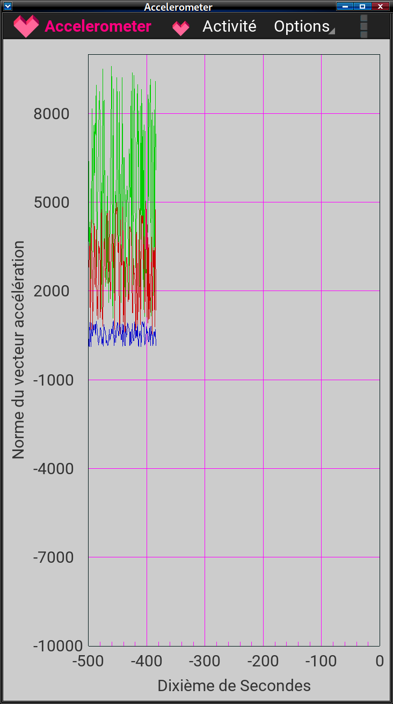

# accelerometer

An application to record and display curve of android acceleromater made with kivy

### La documentation sur le wiki ressources.labomedia.org

[Kivy: Accelerometer](https://ressources.labomedia.org/kivy_accelerometer)

### Made with

* Debian 10
* kivy
* python 3
* Garden Graph

### Merci à

* [La Labomedia](https://labomedia.org)
